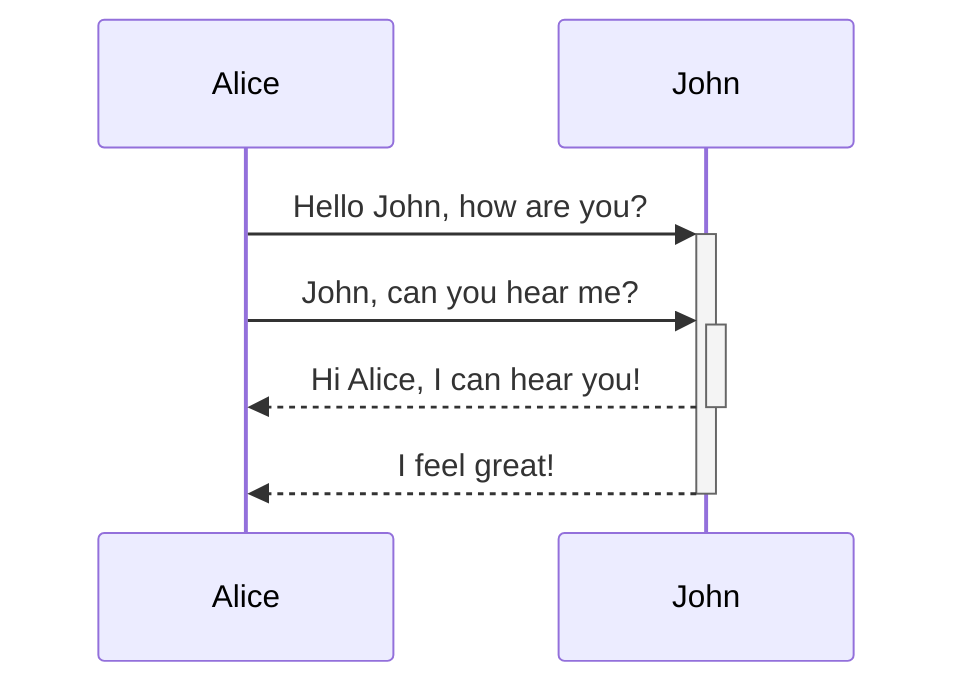
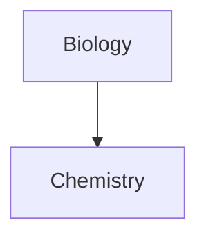
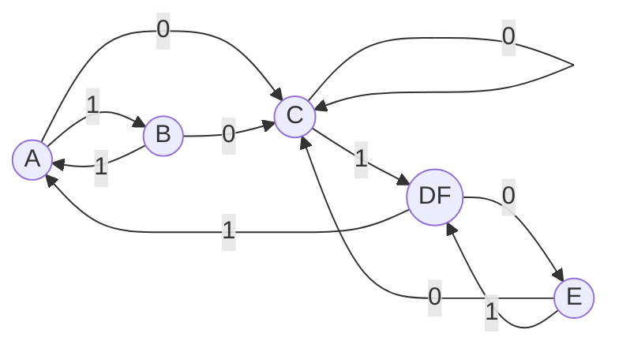

# first-time
just being started

# title1
#### title2

- *italics*

- **bold**
- something


---

# This is a heading 1
## This is a heading 2
### This is a heading 3 
#### This is a heading 4
##### This is a heading 5
###### This is a heading 6

---

*This text will be italic*
_This will also be italic_

**This text will be bold**
__This will also be bold__

---

- Item 1
- Item 2
  - Item 2a
  - Item 2b

1. Item 1
2. Item 2
3. Item 3
   1. Item 3a
   2. Item 3b

---


---

http://obsidian.md - automatic!
[Obsidian](http://obsidian.md)

shortcut : ctrl + k

---

[Link to note](obsidian://open?path=D:%2Fpath%2Fto%2Ffile.md)

---

> Human beings face ever more complex and urgent problems, and their effectiveness in dealing with these problems is a matter that is critical to the stability and continued progress of society.

---

Text inside `backticks` on a line will be formatted like code.

---

```js
function fancyAlert(arg) {
  if(arg) {
    $.facebox({div:'#foo'})
  }
}
```

---

- [x] #tags, [links](), **formatting** supported
- [x] list syntax required (any unordered or ordered list supported)
- [x] this is a complete item
- [x] this is also a complete item (works with every character)
- [ ] this is an incomplete item
- [ ] tasks can be clicked in Preview to be checked off

shortcut : ctrl + enter

---

First Header | Second Header
--- | ---
Content from cell 1 | Content from cell 2
Content in the first column | Content in the second column

---

Any word wrapped with two tildes ~~ (like ~~this~~) will appear crossed out.

---

Use two equal signs to ==highlight text==.

---

Use three stars ***, minuses ---, or underscores ___ in a new line to produce an horizontal bar.

---

Here's a simple footnote,[^1] and here's a longer one.[^bignote]

[^1]: meaningful!

[^bignote]: Here's one with multiple paragraphs and code.

    Indent paragraphs to include them in the footnote.

    `{ my code }`

    Add as many paragraphs as you like.


---

$$\begin{vmatrix}a & b\\
c & d
\end{vmatrix}=ad-bc$$

---

Here is some inline comments: %%You can't see this text%% (Can't see it)

Here is a block comment:
%%
It can span
multiple lines
%%

---

> [!INFO]
> Here's a callout block.
> It supports **markdown** and [[Internal link|wikilinks]].

---






---



---

$$ E = MC^2 $$
